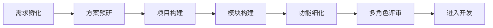

# PRD Creator Skill

A professional Product Requirement Document (PRD) creation skill using AI-driven 6-phase SOP workflow with three-tier document structure and multi-role review.

[中文](#中文说明) | [English](#english-description)

---

## 中文说明

### 🎯 简介

**PRD Creator** 是一个专业的 AI 驱动产品需求文档（PRD）创建工具，采用标准化的 6 阶段 SOP 工作流，支持**三层文档结构（项目→模块→功能）**和多角色评审。

### 📊 6 阶段工作流



| 阶段 | 名称 | 核心动作 | 产出物 |
|------|------|----------|--------|
| 1 | 需求孵化 | 人机对话澄清需求 | 《需求描述文档》 |
| 2 | 方案预研 | AI 搜索最佳实践 | 《技术预研报告》+ 项目/模块清单 |
| 3 | 项目构建 | 创建项目目录 | `P001/` 目录 + 项目 README |
| 4 | 模块构建 | 生成模块级 PRD | `P001/M001-xxx.md` + 架构图 |
| 5 | 功能细化 | 生成功能级 PRD | `P001/M001/F001-xxx.md` + 流程图 |
| 6 | 多角色评审 | 测试/研发/产品等评审 | 《评审报告》+ 修改清单 |

### ✨ 核心特性

- **🤖 AI 驱动**：自动搜索技术方案、生成架构图
- **🏗️ 三层结构**：项目(P) → 模块(M) → 功能(F) 分层管理
- **👥 多角色评审**：支持产品、研发、测试、设计等角色评审
- **🎨 高质量图表**：使用 [beautiful-mermaid](https://github.com/lukilabs/beautiful-mermaid) 渲染美观 SVG
- **🔁 迭代友好**：从 PRD 到代码的无缝衔接

### 📁 文档结构（三层结构）

```
prd/
├── P001-用户中心平台/          # 项目目录
│   ├── README.md               # 项目概述
│   ├── M001-用户认证.md        # 模块文档
│   ├── M001/                   # 功能子目录
│   │   ├── F001-注册登录.md
│   │   ├── F002-密码找回.md
│   │   └── F003-第三方登录.md
│   ├── M002-账户管理.md
│   └── M002/
│       ├── F001-资料修改.md
│       └── F002-账号注销.md
├── P002-订单管理系统/
│   ├── README.md
│   ├── M001-订单核心.md
│   └── M001/
│       ├── F001-创建订单.md
│       └── F002-取消订单.md
└── P003-报表统计系统/
    ├── README.md
    └── M001-数据看板.md
```

**命名规范**：
- 项目：`P{三位}-{项目名}/` (如 `P001-用户中心平台/`)
- 模块：`Pxxx/M{三位}-{模块名}.md` (如 `P001/M001-用户认证.md`)
- 功能：`Pxxx/Mxxx/F{三位}-{功能名}.md` (如 `P001/M001/F001-注册登录.md`)

### 🚀 快速开始

#### 安装

**对于 Kimi CLI：**

```bash
# 克隆仓库
git clone https://github.com/huchi996/prd-creator-skill.git

# 复制到 Kimi skills 目录
cp -r prd-creator-skill ~/.agents/skills/
```

**对于其他 AI Agent：**

将本 skill 复制到你的 AI Agent skills 目录：

```bash
# 复制到对应的 skills 目录
```

#### 使用

1. **创建完整 PRD**
   ```
   用户: "我要做一个员工考勤系统，帮我创建PRD"
   
   AI 将自动执行 6 阶段流程：
   - Phase 1-2: 需求澄清和技术预研
   - Phase 3: 创建项目目录 P001-考勤系统/
   - Phase 4: 创建模块 M001-打卡引擎、M002-排班管理...
   - Phase 5: 创建功能 F001-打卡记录、F002-请假审批...
   - Phase 6: 多角色评审
   ```

2. **多角色评审**
   ```
   用户: "请对这个PRD进行多角色评审"
   
   或指定角色：
   用户: "请以测试工程师的角度评审这个PRD"
   ```

### 🎨 图表渲染

本 skill 使用 **[beautiful-mermaid](https://github.com/lukilabs/beautiful-mermaid)** 渲染高质量 SVG 图表：

- **15+ 内置主题**：tokyo-night、catppuccin-mocha、nord、github 等
- **双输出模式**：SVG（富 UI）和 ASCII（终端）
- **零 DOM 依赖**：支持服务器端渲染

```javascript
import { renderMermaid, THEMES } from 'beautiful-mermaid'

const svg = await renderMermaid(diagram, THEMES['tokyo-night'])
```

### 📖 使用示例

#### 示例 1：完整 PRD 流程

```
用户: 我要做一个轻量级任务管理系统

AI:
[Phase 1] 需求澄清：目标用户是谁？核心场景？
[Phase 2] 方案预研：搜索竞品、推荐技术栈
[Phase 3] 项目构建：创建 P001-任务管理系统/
[Phase 4] 模块构建：M001-看板视图、M002-任务管理...
[Phase 5] 功能细化：F001-按项目看板、F002-拖拽排序...
[Phase 6] 多角色评审：👤💻🧪🎨 各角色意见...

产出：prd/ 目录下完整的 PRD 文档
```

#### 示例 2：三层结构输出

```
prd/
├── P001-任务管理系统/
│   ├── README.md              # 项目概述
│   ├── M001-看板视图.md       # 模块：看板视图
│   └── M001/
│       ├── F001-列表视图.md   # 功能：列表视图
│       └── F002-拖拽排序.md   # 功能：拖拽排序
└── P002-报表系统/
    ├── README.md
    └── M001-数据看板.md
```

### 👥 评审角色

| 角色 | 关注维度 | 检查清单 |
|------|----------|----------|
| 👤 产品经理 | 业务完整性 | `review-checklists.md` - 产品经理部分 |
| 💻 研发工程师 | 技术可行性 | `review-checklists.md` - 研发部分 |
| 🧪 测试工程师 | 可测试性 | `review-checklists.md` - 测试部分 |
| 🎨 UI/UX设计师 | 交互体验 | `review-checklists.md` - 设计部分 |
| 🚀 运维工程师 | 部署运维 | `review-checklists.md` - 运维部分 |

### 📄 许可证

MIT License - 详见 [LICENSE](LICENSE) 文件

---

## English Description

### 🎯 Overview

**PRD Creator** is a professional AI-driven Product Requirement Document creation tool using a standardized 6-phase SOP workflow with **three-tier document structure (Project → Module → Feature)** and multi-role review capabilities.

### 📊 6-Phase Workflow

| Phase | Name | Action | Output |
|-------|------|--------|--------|
| 1 | Requirement Incubation | Human-AI collaboration | Requirement Summary |
| 2 | Solution Research | AI-powered tech research | Research Report + Project/Module List |
| 3 | Project Construction | Create project directory | `P001/` + Project README |
| 4 | Module Construction | Module-level PRD | `P001/M001-xxx.md` + Architecture |
| 5 | Feature Elaboration | Feature-level PRD | `P001/M001/F001-xxx.md` + Flowcharts |
| 6 | Multi-Role Review | QA/Dev/PM review | Review Report + Action Items |

### ✨ Key Features

- **🤖 AI-Powered**: Auto-search technical solutions, generate architecture diagrams
- **🏗️ Three-Tier Structure**: Project(P) → Module(M) → Feature(F) layered management
- **👥 Multi-Role Review**: Support PM, Dev, QA, Designer roles
- **🎨 High-Quality Diagrams**: Use [beautiful-mermaid](https://github.com/lukilabs/beautiful-mermaid) for beautiful SVG rendering
- **🔁 Iteration-Friendly**: Seamless handoff from PRD to code

### 📁 Document Structure (Three-Tier)

```
prd/
├── P001-user-center/           # Project directory
│   ├── README.md               # Project overview
│   ├── M001-auth.md            # Module document
│   ├── M001/                   # Feature subdirectory
│   │   ├── F001-login.md
│   │   ├── F002-register.md
│   │   └── F003-oauth.md
│   ├── M002-account.md
│   └── M002/
│       ├── F001-profile.md
│       └── F002-settings.md
└── P002-order-system/
    ├── README.md
    └── M001-order-core.md
```

**Naming Convention**:
- Project: `P{3-digit}-{name}/` (e.g., `P001-user-center/`)
- Module: `Pxxx/M{3-digit}-{name}.md` (e.g., `P001/M001-auth.md`)
- Feature: `Pxxx/Mxxx/F{3-digit}-{name}.md` (e.g., `P001/M001/F001-login.md`)

### 🚀 Quick Start

#### Installation

**For Kimi CLI:**

```bash
# Clone repository
git clone https://github.com/huchi996/prd-creator-skill.git

# Copy to Kimi skills directory
cp -r prd-creator-skill ~/.agents/skills/
```

**For other AI Agents:**

Copy this skill to your AI Agent skills directory.

#### Usage

```
User: "I want to build a task management system, help me create a PRD"

AI will execute 6-phase workflow automatically:
- Phase 1-2: Requirement clarification & tech research
- Phase 3: Create project directory P001-task-system/
- Phase 4: Create modules M001-kanban, M002-task...
- Phase 5: Create features F001-list-view, F002-drag-drop...
- Phase 6: Multi-role review
```

### 🎨 Diagram Rendering

This skill uses **[beautiful-mermaid](https://github.com/lukilabs/beautiful-mermaid)** for high-quality SVG diagram rendering:

- **15+ Built-in Themes**: tokyo-night, catppuccin-mocha, nord, github, etc.
- **Dual Output**: SVG (rich UI) and ASCII (terminal)
- **Zero DOM Dependencies**: Server-side rendering support

```javascript
import { renderMermaid, THEMES } from 'beautiful-mermaid'

const svg = await renderMermaid(diagram, THEMES['tokyo-night'])
```

### 📄 License

MIT License - see [LICENSE](LICENSE) file

---

## 版本历史 / Changelog

See [CHANGELOG.md](CHANGELOG.md) for version history.

---

## 贡献指南 / Contributing

欢迎提交 Issue 和 PR！

Issues and PRs are welcome!

---

**Made with ❤️ for better product documentation**
