# PRD Creator Skill

A professional Product Requirement Document (PRD) creation skill using AI-driven 5-phase SOP workflow with multi-role review.

[中文](#中文说明) | [English](#english-description)

---

## 中文说明

### 🎯 简介

**PRD Creator** 是一个专业的 AI 驱动产品需求文档（PRD）创建工具，采用标准化的 5 阶段 SOP 工作流，并支持多角色评审。

### 📊 5 阶段工作流

```mermaid
flowchart LR
    A[需求孵化] --> B[方案预研]
    B --> C[模块构建]
    C --> D[功能细化]
    D --> E[多角色评审]
    E --> F[进入开发]
```



| 阶段 | 名称 | 产出物 |
|------|------|--------|
| 1 | 需求孵化 | 《需求描述文档》 |
| 2 | 方案预研 | 《技术预研报告》+ 模块清单 |
| 3 | 模块构建 | 模块级 PRD (`M001-xxx.md`) |
| 4 | 功能细化 | 功能级 PRD (`M001/F001-xxx.md`) |
| 5 | 多角色评审 | 《评审报告》+ 修改清单 |

### ✨ 核心特性

- **🤖 AI 驱动**：自动搜索技术方案、生成架构图
- **📐 标准化**：模块化 PRD 结构，易于维护
- **👥 多角色评审**：支持产品、研发、测试、设计等角色评审
- **📈 可视化**：使用 Mermaid 图表展示架构和流程
- **🔁 迭代友好**：从 PRD 到代码的无缝衔接

### 📁 文件结构

```
prd-creator-skill/
├── SKILL.md                          # Skill 主文件
├── README.md                         # 本文件
├── LICENSE                           # MIT 许可证
├── assets/                           # 模板文件
│   ├── module-template.md            # 模块级 PRD 模板
│   ├── feature-template.md           # 功能级 PRD 模板
│   ├── requirement-summary-template.md
│   ├── review-template.md            # 评审报告模板
│   ├── review-checklists.md          # 评审检查清单
│   └── review-example.md             # 评审示例
└── references/
    └── sop-guide.md                  # SOP 指南
```

### 🚀 快速开始

#### 安装

将本 skill 复制到你的 AI Agent skills 目录：

```bash
# 对于 Kimi CLI
cp -r prd-creator-skill ~/.kimi/skills/

# 对于其他 AI Agent，复制到对应的 skills 目录
```

#### 使用

1. **创建完整 PRD**
   ```
   用户: "我要做一个员工考勤系统，帮我创建PRD"
   ```

2. **多角色评审**
   ```
   用户: "请对这个PRD进行多角色评审"
   
   或指定角色：
   用户: "请以测试工程师的角度评审这个PRD"
   ```

3. **关注特定维度**
   ```
   用户: "请从性能和安全性角度评审这个PRD"
   ```

### 📖 使用示例

#### 示例 1：完整 PRD 流程

```
用户: 我要做一个轻量级任务管理系统

AI: 
[Phase 1] 需求澄清：目标用户是谁？核心场景？
[Phase 2] 方案预研：搜索竞品、推荐技术栈
[Phase 3] 模块拆分：M001-看板视图、M002-任务管理...
[Phase 4] 功能细化：F001-按项目看板、F002-拖拽排序...
[Phase 5] 多角色评审：👤💻🧪🎨 各角色意见...

产出：prd/ 目录下完整的 PRD 文档
```

#### 示例 2：多角色评审输出

```
--- 👤 产品经理评审 ---
✅ 业务逻辑完整
⚠️ 建议：补充字段长度约束

--- 💻 研发工程师评审 ---
✅ 技术方案可行
⚠️ 风险：乐观锁实现复杂度较高

--- 🧪 测试工程师评审 ---
🔴 问题：缺少验收标准
🔴 问题：边界情况覆盖不足

评审结论：条件通过，修改高风险问题后进入开发
```

### 👥 评审角色

| 角色 | 关注维度 | 检查清单 |
|------|----------|----------|
| 👤 产品经理 | 业务完整性 | `review-checklists.md` - 产品经理部分 |
| 💻 研发工程师 | 技术可行性 | `review-checklists.md` - 研发部分 |
| 🧪 测试工程师 | 可测试性 | `review-checklists.md` - 测试部分 |
| 🎨 UI/UX设计师 | 交互体验 | `review-checklists.md` - 设计部分 |
| 🚀 运维工程师 | 部署运维 | `review-checklists.md` - 运维部分 |

### 📄 许可证

MIT License - 详见 [LICENSE](LICENSE) 文件

---

## English Description

### 🎯 Overview

**PRD Creator** is a professional AI-driven Product Requirement Document creation tool using a standardized 5-phase SOP workflow with multi-role review capabilities.

### 📊 5-Phase Workflow

| Phase | Name | Output |
|-------|------|--------|
| 1 | Requirement Incubation | Requirement Summary Document |
| 2 | Solution Research | Technical Research Report + Module List |
| 3 | Module Construction | Module-level PRD (`M001-xxx.md`) |
| 4 | Feature Elaboration | Feature-level PRD (`M001/F001-xxx.md`) |
| 5 | Multi-Role Review | Review Report + Action Items |

### ✨ Key Features

- **🤖 AI-Powered**: Auto-search technical solutions, generate architecture diagrams
- **📐 Standardized**: Modular PRD structure, easy to maintain
- **👥 Multi-Role Review**: Support PM, Dev, QA, Designer roles
- **📈 Visualization**: Use Mermaid diagrams for architecture and flows
- **🔁 Iteration-Friendly**: Seamless handoff from PRD to code

### 🚀 Quick Start

#### Installation

Copy this skill to your AI Agent skills directory:

```bash
# For Kimi CLI
cp -r prd-creator-skill ~/.kimi/skills/

# For other AI agents, copy to the corresponding skills directory
```

#### Usage

```
User: "I want to build a task management system, help me create a PRD"

User: "Please conduct a multi-role review of this PRD"

User: "Please review this PRD from a test engineer's perspective"
```

### 📄 License

MIT License - see [LICENSE](LICENSE) file

---

## 贡献指南 / Contributing

欢迎提交 Issue 和 PR！

Issues and PRs are welcome!

---

**Made with ❤️ for better product documentation**
