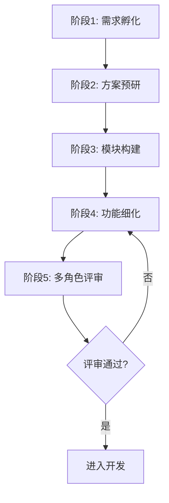
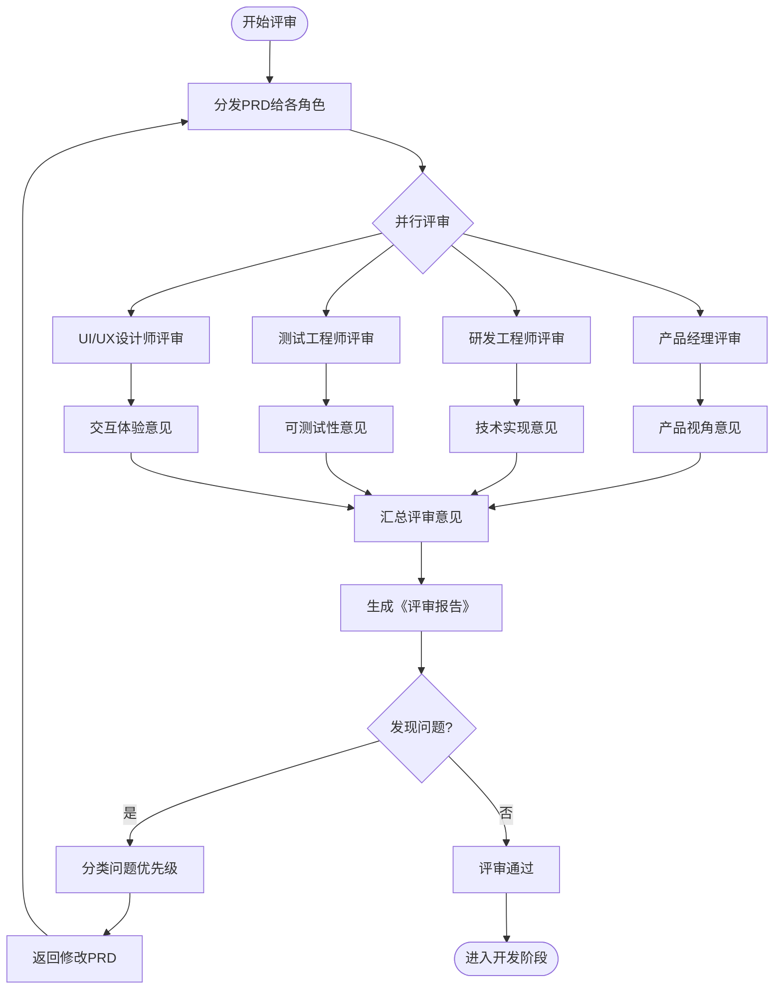

# PRD Creator - AI驱动型标准化作业程序

Create well-structured Product Requirement Documents following a 4-phase AI-driven SOP workflow with multi-role review.

## 5-Phase Workflow Overview



| 阶段 | 名称 | 核心动作 | 产出物 |
|------|------|----------|--------|
| 1 | 需求孵化 | 人机对话澄清需求 | 《需求描述文档》 |
| 2 | 方案预研 | AI搜索最佳实践 | 《技术预研报告》+ 模块清单 |
| 3 | 模块构建 | 生成模块级PRD | `M001-xxx.md` + 架构图 |
| 4 | 功能细化 | 生成功能级PRD | `M001/F001-xxx.md` + 流程图 |
| **5** | **多角色评审** | **测试/研发/产品等角色评审** | **《评审报告》+ 修改清单** |

---

## Phase 1: 需求孵化 (Requirement Incubation)

### Goal
将模糊想法转化为清晰的需求描述文档。

### Steps
1. **用户输入** - 接收自然语言需求描述
2. **AI澄清** - 通过多轮提问明确边界（用户画像、核心场景、排除范围）
3. **输出确认** - 生成结构化的《需求描述文档》

### Key Questions to Ask
- 目标用户是谁？有哪些使用场景？
- 核心功能点有哪些？优先级如何？
- 有什么必须排除在范围外的功能？
- 预期上线时间或里程碑？

---

## Phase 2: 方案预研 (Solution Research)

### Goal
利用AI搜索能力进行技术可行性研究和竞品分析，确定模块划分。

### Steps
1. **联网搜索** - SearchWeb 搜索相关技术方案、竞品分析、开源解决方案
2. **方案对比** - 提供主流架构对比、推荐技术栈、潜在风险分析
3. **模块拆分** - 基于调研结果，生成模块清单（M001, M002...）

### Naming Convention
- **模块文件**: `M{三位编号}-{模块名}.md` (e.g., `M001-用户中心.md`)
- **功能文件**: `M{编号}/F{三位编号}-{功能名}.md` (e.g., `M001/F001-注册登录.md`)

### Output
- 《技术预研报告》（包含：竞品分析、技术栈建议、风险清单）
- 模块拆分清单（待用户确认后进入Phase 3）

---

## Phase 3: 模块构建 (Module Construction)

### Goal
生成模块主文档，定义模块的宏观逻辑与架构。

### Directory Structure
```
prd/
├── M001-用户中心.md      <-- 模块主文档
├── M001/                 <-- 功能子目录
│   ├── F001-注册登录.md
│   └── F002-信息修改.md
├── M002-考勤引擎.md
└── M002/
    └── F001-打卡记录.md
```

### Module Document Template
使用 `assets/module-template.md` 创建模块级文档，必须包含：
1. **模块概述** - 业务背景与目标
2. **架构设计** - Mermaid Context Diagram
3. **模块边界** - 依赖关系（依赖谁、被谁依赖）
4. **功能清单** - 该模块下的功能点预览

### Mermaid Diagrams for Modules
- **Context Diagram**: 展示模块与外部系统的交互
- **Container Diagram**: 展示模块内部组件关系

---

## Phase 4: 功能细化 (Feature Elaboration)

### Goal
深入具体功能点，输出可指导开发的详细文档。

### Feature Document Template
使用 `assets/feature-template.md` 创建功能级文档，必须包含：
1. **功能说明** - 一句话描述功能价值
2. **业务流程图** - Mermaid Sequence/Flowchart
3. **状态图** (如有) - 复杂状态流转
4. **详细逻辑**:
   - 输入与校验规则
   - 业务规则与计算逻辑
   - 异常处理策略
5. **接口定义** (可选) - 关键API的Method/Params/Response
6. **数据模型** (可选) - 核心实体字段定义

### Mermaid Diagrams for Features
- **Sequence Diagram**: 展示系统间交互时序
- **Flowchart**: 展示业务流程分支
- **State Diagram**: 展示状态机流转

---

## Phase 5: 多角色评审 (Multi-Role Review) ⭐

### Goal
引入不同角色（产品经理、研发工程师、测试工程师、UI/UX设计师等）从不同维度评审PRD，确保需求的完整性、可实施性和可测试性。

### Review Process



### Review Roles & Focus Areas

| 角色 | 关注点 | 评审维度 |
|------|--------|----------|
| **产品经理** | 业务逻辑完整性 | 需求是否清晰、场景是否覆盖、优先级是否合理 |
| **研发工程师** | 技术可行性 | 实现难度、技术风险、性能影响、架构合理性 |
| **测试工程师** | 可测试性 | 验收标准是否明确、边界情况是否覆盖、测试数据需求 |
| **UI/UX设计师** | 交互体验 | 用户流程是否顺畅、交互细节是否明确、视觉规范 |
| **运维工程师** | 部署运维 | 部署方案、监控需求、容量规划、回滚策略 |

### Review Output

每个角色需输出：
1. **评审意见** - 发现的问题和建议
2. **风险评级** - 高/中/低
3. **修改建议** - 具体的修改方案

使用 `assets/review-template.md` 生成标准评审报告。

---

## Complete Workflow Execution

### Starting a New PRD Project

```
用户: "我要做一个员工考勤系统"

You: "我将按照5阶段SOP帮您创建PRD。首先进入阶段1：需求孵化。
      请描述：1) 目标用户 2) 核心场景 3) 关键功能点 4) 预期上线时间？"

[Phase 1: 多轮对话澄清需求 -> 输出需求描述文档]

You: "需求已明确。现在进入阶段2：方案预研。
      让我搜索相关技术方案和竞品做法..."

[Phase 2: SearchWeb搜索 -> 输出技术预研报告 + 模块清单]

You: "建议拆分为以下模块：
      - M001-用户中心
      - M002-考勤引擎
      - M003-报表统计
      确认后开始生成模块文档？"

[Phase 3: 逐个创建 M001-xxx.md, M002-xxx.md...]

[Phase 4: 为每个模块创建 F001-xxx.md, F002-xxx.md...]

You: "PRD初稿已完成。现在进入阶段5：多角色评审。
      我将模拟产品经理、研发工程师、测试工程师等角色进行评审..."

[Phase 5: 多角色评审 -> 生成评审报告 -> 修改PRD]

You: "评审已完成，PRD已根据意见修改。现在可以进入开发阶段了！"
```

### File Generation Rules
1. 先创建目录 `prd/`
2. Phase 3: 每个模块创建一个 `Mxxx-名称.md` 在根目录
3. Phase 4: 为每个模块创建子目录 `Mxxx/`，内含功能文档
4. Phase 5: 生成 `prd/评审报告.md` 记录各角色意见
5. 所有文档使用 `.md` 格式，内嵌 Mermaid 图表

---

## Best Practices

See `references/sop-guide.md` for:
- 编写高质量用户故事的方法
- Mermaid 图表最佳实践
- 模块拆分的粒度把控
- 从PRD到代码的闭环工作流

See `references/multi-role-review-guide.md` for:
- 各角色评审检查清单
- 评审会议组织流程
- 冲突处理与决策机制
- 评审报告撰写规范

## Templates

### PRD文档模板
- `assets/module-template.md` - 模块级PRD模板
- `assets/feature-template.md` - 功能级PRD模板
- `assets/requirement-summary-template.md` - 需求描述文档模板

### 多角色评审模板 ⭐
- `assets/review-template.md` - **多角色评审报告模板**
- `assets/review-checklists.md` - **各角色评审检查清单**
- `assets/review-example.md` - **多角色评审示例**（轻团队看板案例）

---

## 使用示例

### 示例1：完整PRD流程（含多角色评审）

```
用户: "我要做一个轻量级任务管理系统，帮我创建PRD"

[Phase 1-4: 按SOP完成PRD编写]

你: "PRD初稿已完成。现在进行多角色评审：

--- 👤 产品经理评审 ---
✅ 业务逻辑完整，场景覆盖全面
⚠️ 建议：补充字段长度约束
⚠️ 建议：明确任务删除策略（软删除）

--- 💻 研发工程师评审 ---
✅ 技术方案可行
⚠️ 风险：乐观锁实现复杂度较高，MVP建议简化
⚠️ 建议：SQLite启用WAL模式提升并发

--- 🧪 测试工程师评审 ---
✅ 功能可测试性良好
🔴 问题：缺少验收标准（响应时间、并发数等）
🔴 问题：边界情况覆盖不足（最大任务数等）
⚠️ 建议：补充兼容性要求

--- 🎨 UI/UX设计师评审 ---
✅ 交互设计清晰
⚠️ 建议：补充空状态、加载状态定义
⚠️ 建议：统一错误提示方式

--- 📊 评审总结 ---
【高风险问题】3个
【中风险问题】4个
【建议优化】3个

评审结论：条件通过，修改高风险问题后进入开发
"
```

### 示例2：指定特定角色评审

```
用户: "请以测试工程师的角度评审这个PRD"

你: "🧪 测试工程师评审意见：

【发现的问题】
1. 🔴 F001-按项目看板视图：缺少验收标准
   - 建议：明确'快速加载'的具体数值（如<1秒）

2. 🔴 F004-拖拽排序功能：缺少边界约束
   - 建议：定义最大任务数、最长任务标题

3. 🟡 F007-编辑任务：并发测试场景缺失
   - 建议：补充多用户同时编辑的测试用例

【可测试性评价】
- 功能入口：清晰 ✅
- 预期结果：部分缺失 ⚠️
- 边界情况：覆盖不足 🔴

【测试工作量估算】
- 功能测试：约70个用例
- 接口测试：约20个用例
- 兼容性测试：待明确范围
"
```

### 示例3：快速评审特定方面

```
用户: "请从性能和安全性角度评审这个PRD"

你: "💻 性能与安全评审：

【性能方面】
✅ 架构设计合理，无明显的性能瓶颈
⚠️ 建议：补充性能指标（QPS、响应时间P99）
⚠️ 建议：明确缓存策略

【安全方面】
🔴 问题：缺少输入校验规则（XSS、SQL注入）
🟡 建议：明确敏感数据存储加密方案
🟡 建议：补充权限控制粒度说明
"
```
