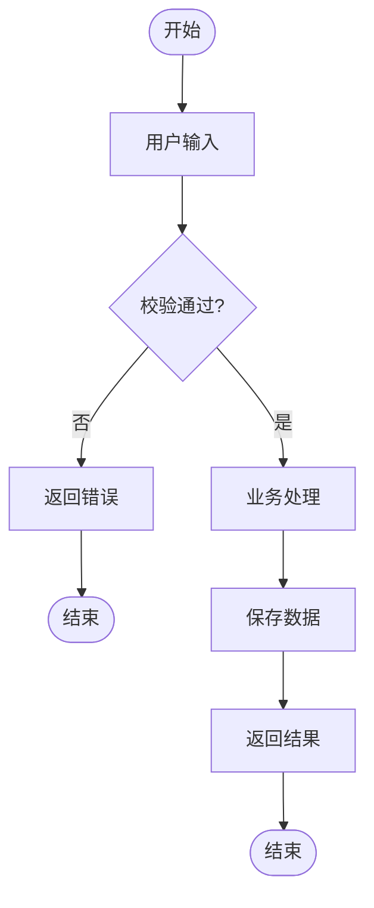
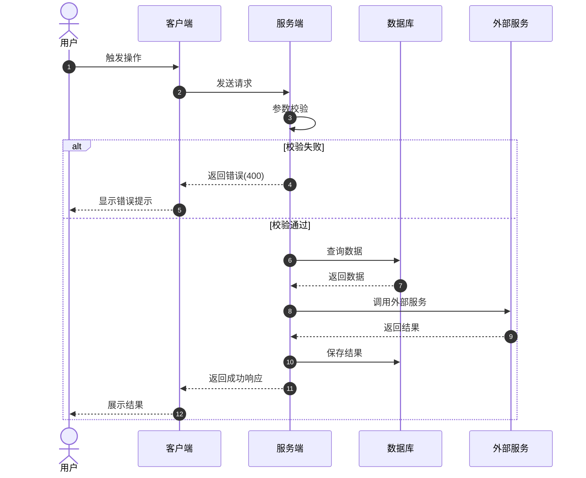
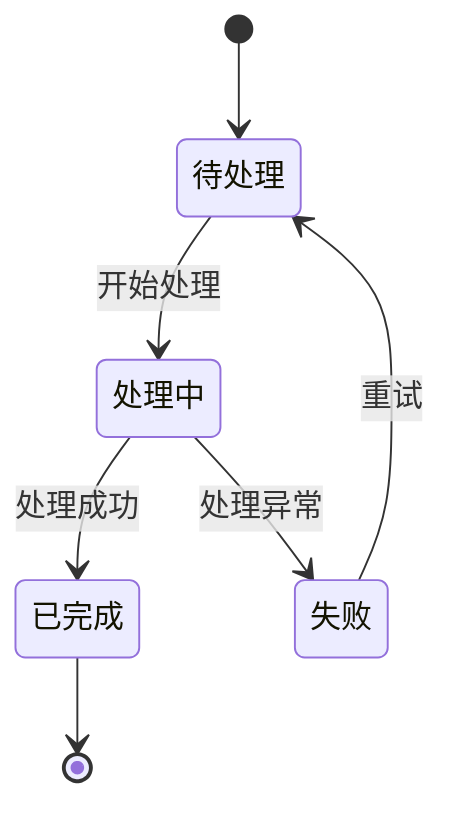

# F{编号} - {功能名称}

> **所属模块**: M{编号}-{模块名}  
> **功能编号**: F{编号}  
> **优先级**: P0/P1/P2  
> **版本**: v1.0  
> **创建日期**: {YYYY-MM-DD}

---

> **图表渲染**: 本文档中的流程图使用 [beautiful-mermaid](https://github.com/lukilabs/beautiful-mermaid) 渲染。推荐使用 `tokyo-night` 或 `catppuccin-mocha` 主题获得最佳视觉效果。

---

## 1. 功能说明

### 1.1 一句话描述
[简洁描述这个功能是什么]

### 1.2 用户价值
[为什么用户需要这个功能？解决什么痛点？]

### 1.3 使用场景
| 场景 | 描述 | 触发条件 |
|------|------|----------|
| [场景1] | [描述] | [什么情况下触发] |
| [场景2] | [描述] | [什么情况下触发] |

---

## 2. 业务流程图

### 2.1 主流程 (Flowchart)



### 2.2 时序图 (Sequence Diagram)
展示系统组件间的交互：



### 2.3 状态图 (State Diagram) [可选]
适用于有复杂状态流转的功能：



---

## 3. 详细逻辑

### 3.1 输入与校验

#### 输入字段
| 字段名 | 类型 | 必填 | 校验规则 | 示例值 |
|--------|------|------|----------|--------|
| [字段1] | String | 是 | 长度1-50，正则xxx | [示例] |
| [字段2] | Number | 否 | 范围0-100 | [示例] |
| [字段3] | Enum | 是 | [A, B, C] | [示例] |

#### 校验规则详解
1. **[字段1]**: 
   - 格式：正则表达式
   - 唯一性：是否需要全局唯一
   - 敏感词：是否过滤

2. **[字段2]**:
   - 业务规则：[描述]

### 3.2 业务规则

#### 规则1: [规则名称]
**描述**: [规则详细说明]

**伪代码**:
```
IF [条件1] AND [条件2] THEN
    [执行动作1]
ELSE IF [条件3] THEN
    [执行动作2]
ELSE
    [执行动作3]
END IF
```

#### 规则2: [规则名称]
...

### 3.3 异常处理

| 异常场景 | 错误码 | 错误信息 | 处理策略 |
|----------|--------|----------|----------|
| 参数非法 | 400001 | "参数xxx格式错误" | 返回400，提示用户 |
| 业务限制 | 400002 | "超出最大限制" | 返回400，说明限制 |
| 系统错误 | 500001 | "服务繁忙，请重试" | 记录日志，返回500 |

---

## 4. 接口定义 [可选]

### 4.1 请求
```
POST /api/v1/{模块}/{功能}
Content-Type: application/json
Authorization: Bearer {token}
```

**请求体**:
```json
{
  "field1": "string",
  "field2": 123,
  "field3": "ENUM_VALUE"
}
```

### 4.2 响应

**成功响应 (200)**:
```json
{
  "code": 0,
  "message": "success",
  "data": {
    "id": "string",
    "status": "success"
  }
}
```

**错误响应**:
```json
{
  "code": 400001,
  "message": "参数错误: xxx"
}
```

---

## 5. 数据模型 [可选]

### 5.1 核心实体
```
Entity: [实体名]
├── id: String (PK)
├── field1: String
├── field2: Number
├── status: Enum
├── createdAt: DateTime
└── updatedAt: DateTime
```

### 5.2 数据库表结构
| 字段 | 类型 | 约束 | 说明 |
|------|------|------|------|
| id | BIGINT | PK, Auto | 主键 |
| field1 | VARCHAR(50) | Not Null, Unique | [说明] |
| created_at | TIMESTAMP | Default NOW() | 创建时间 |

---

## 6. 边界情况

| 场景 | 预期行为 |
|------|----------|
| 并发请求 | [如何处理并发] |
| 数据量大 | [分页/异步策略] |
| 网络中断 | [重试/补偿机制] |
| 外部服务超时 | [降级/熔断策略] |

---

## 7. 相关文档

- 所属模块: [Mxxx-模块名.md](../M{编号}-模块名.md)
- 项目概述: [README.md](../../README.md)
- 相关功能: [Fxxx-功能名.md](./Fxxx-功能名.md)
- 设计稿: [Figma链接]

---

## 附录

### 变更历史
| 版本 | 日期 | 变更内容 | 作者 |
|------|------|----------|------|
| v1.0 | [日期] | 初始版本 | [姓名] |
