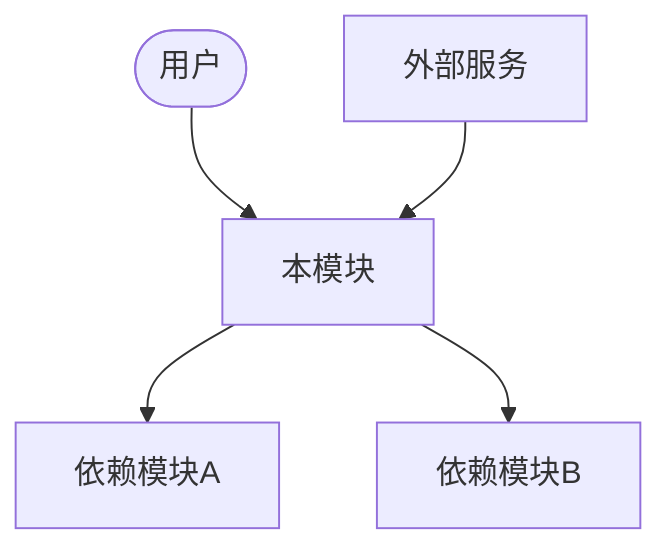
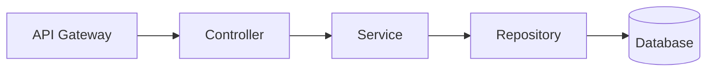
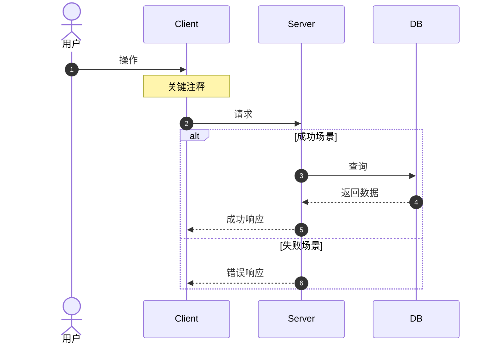

# AI驱动型PRD标准化作业程序 (SOP) 指南

## SOP 核心理念

这套SOP将PRD创建分为**五个递进阶段**，利用AI能力实现：
- **需求结构化**: 自然语言 → 标准化文档
- **方案智能化**: AI搜索行业最佳实践
- **文档模块化**: 分层管理，解耦依赖
- **逻辑可视化**: Mermaid图表替代大段文字

---

## 五阶段深度解读

### Phase 1: 需求孵化 (Human-AI Collaboration)

#### 核心原则
- **从模糊到清晰**: AI通过提问帮助用户梳理思路
- **双向确认**: 不是单向输出，而是多轮对话达成共识
- **文档沉淀**: 最终产出结构化的需求描述文档

#### 提问框架 (5W2H)
| 维度 | 问题 | 目的 |
|------|------|------|
| Who | 谁是目标用户？ | 明确用户画像 |
| What | 核心功能是什么？ | 定义功能边界 |
| Why | 解决什么痛点？ | 验证价值假设 |
| When | 什么时间上线？ | 确定时间约束 |
| Where | 使用场景在哪？ | 理解上下文 |
| How | 用户如何使用？ | 梳理交互流程 |
| How Much | 预期规模多大？ | 评估技术方案 |

#### 产出标准
需求描述文档必须包含：
- 清晰的用户画像（至少1个Primary）
- 功能优先级划分（Must/Should/Could）
- 明确的范围边界（In/Out Scope）

---

### Phase 2: 方案预研 (AI Research)

#### 核心动作
1. **联网搜索**: 使用SearchWeb搜索相关技术方案
2. **竞品分析**: 研究同类产品的实现方式
3. **技术选型**: 对比不同技术栈的优缺点
4. **模块拆分**: 基于调研结果划分业务模块

#### 搜索策略
```
搜索关键词建议:
- "{领域} 系统架构设计"
- "{功能} 最佳实践"
- "{领域} 开源解决方案"
- "{竞品名} 产品分析"
```

#### 模块拆分原则
| 粒度 | 说明 | 示例 |
|------|------|------|
| 太粗 | 一个模块包含多个业务域 | 把"用户+订单+支付"放在一个模块 |
| 适中 | 单一职责，高内聚低耦合 | M001-用户中心, M002-订单管理 |
| 太细 | 功能点过于分散 | 每个API都作为一个模块 |

**建议**: 一个模块包含 3-8 个功能点为宜。

#### 命名规范检查
```
✅ M001-用户中心.md
✅ M001/F001-注册登录.md

❌ 用户中心.md          (缺少编号)
❌ M1-用户.md           (编号不足3位)
❌ M001/F1-登录.md      (功能编号不足3位)
```

---

### Phase 3: 模块构建 (Module-Level PRD)

#### 模块文档核心要素
1. **Context Diagram**: 展示模块与外部的关系
2. **Container Diagram**: 展示模块内部结构
3. **依赖矩阵**: 明确模块间的调用关系

#### Mermaid 图表指南

##### Context Diagram 模板


##### Container Diagram 模板


#### 模块文档 checklist
- [ ] 有明确的业务背景说明
- [ ] 包含Context Diagram
- [ ] 列出了所有外部依赖
- [ ] 列出了所有被依赖关系
- [ ] 功能清单与后续F文档对应

---

### Phase 4: 功能细化 (Feature-Level PRD)

#### 功能拆分原则
一个功能应该是：
- **独立交付**: 可以独立开发、测试、上线
- **用户可见**: 从用户视角定义，而非技术视角
- **可测试**: 有明确的验收标准

#### Mermaid 图表选择指南

| 图表类型 | 适用场景 | 示例 |
|----------|----------|------|
| Flowchart | 业务流程、判断分支 | 审批流程、订单状态流转 |
| Sequence | 系统间交互、时序关系 | API调用流程、支付流程 |
| State | 状态机、生命周期 | 订单状态、任务状态 |
| ER | 数据关系 | 实体关系图 |

##### Sequence Diagram 最佳实践


#### 功能文档 checklist
- [ ] 有用户价值说明
- [ ] 包含Sequence Diagram
- [ ] 输入字段有完整校验规则
- [ ] 业务规则有伪代码或逻辑说明
- [ ] 异常场景有处理策略
- [ ] 边界情况有考虑

---

## 从 PRD 到代码的闭环

### 代码生成 Prompt 模板

当PRD文档准备好后，可以使用以下Prompt让AI生成代码：

```
请根据以下PRD文档生成代码：

**参考文档**:
- 模块架构: prd/M001-用户中心.md
- 功能详情: prd/M001/F001-注册登录.md

**要求**:
1. 使用 {技术栈} 实现
2. 遵循模块架构图中的分层设计
3. 严格按照功能文档的校验规则
4. 包含异常处理逻辑
5. 添加必要的注释说明对应PRD的哪个部分

**输出**:
请生成完整的可运行代码，包括：
- Controller/API 层
- Service 层
- Repository/Model 层
- 单元测试
```

### 数据闭环优势
1. **上下文完整**: AI可以读取完整的模块架构和功能细节
2. **一致性保证**: 代码与文档保持一致，有据可查
3. **可追溯性**: 代码注释可以关联到PRD具体章节
4. **维护便利**: 需求变更时，同步更新文档和代码

---

## 常见问题 FAQ

### Q1: 模块拆分的粒度如何把控？
**A**: 遵循"一个模块一个业务域"原则。如果一个功能：
- 独立的数据表/实体
- 独立的用户群体
- 独立的业务规则
就应该拆分为独立模块。

### Q2: 什么情况下需要画状态图？
**A**: 当功能涉及复杂的状态流转，且有：
- 多个状态节点（>3个）
- 状态间的转换规则复杂
- 有并发/异步的状态变更

### Q3: 如何管理跨模块的功能？
**A**: 
1. 确定主责模块（功能主要归属于谁）
2. 在主责模块中创建功能文档
3. 在相关模块的文档中添加引用链接
4. 在Context Diagram中体现跨模块调用

### Q4: 需求变更如何同步到PRD？
**A**:
1. 更新对应的功能文档 (Fxxx.md)
2. 在变更历史中记录修改内容
3. 如有架构变化，同步更新模块文档 (Mxxx.md)
4. 如有大范围变更，回到Phase 1重新梳理

### Q5: Mermaid图表渲染失败怎么办？
**A**: 
1. 检查语法是否正确（注意缩进和符号）
2. 避免使用中文特殊符号
3. 复杂图表可以拆分为多个小图
4. 使用Mermaid Live Editor验证: https://mermaid.live

---

## 检查清单 (Master Checklist)

### 项目启动前
- [ ] 已完成Phase 1需求文档
- [ ] 已完成Phase 2方案预研
- [ ] 模块拆分已获得团队确认

### 模块文档完成时
- [ ] 所有模块都有Mxxx.md文档
- [ ] 每个模块都有Context Diagram
- [ ] 依赖关系已梳理清楚

### 功能文档完成时
- [ ] 所有功能都有Fxxx.md文档
- [ ] 关键流程有Sequence Diagram
- [ ] 输入校验规则完整
- [ ] 异常场景已覆盖

### 交付前
- [ ] 文档已通过团队评审
- [ ] 开发团队已确认无歧义
- [ ] 测试团队已确认可测试
